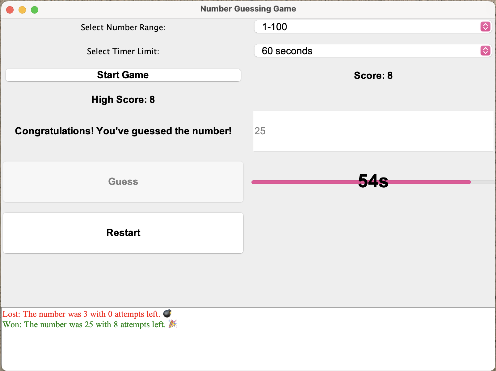

# 🎉 Java Sayı Tahmin Oyunu

Bu proje, Java Swing kullanılarak oluşturulmuş bir GUI tabanlı sayı tahmin oyunudur. Kullanıcıya belirli bir aralıkta rastgele bir sayı tahmin etme imkanı sağlar. Oyun, zaman sınırı ve deneme hakkı içeren seçenekler sunar ve oyun geçmişini gösterir.

## Önizleme



*Önizleme resmi: Oyunun arayüzü ve kullanıcı etkileşimi.*

## Kullanım

Programı çalıştırmak için aşağıdaki adımları izleyin:

1. **Kaynak kodu derleyin:**
    ```sh
    javac NumberGuessingGame.java
    ```

2. **Programı çalıştırın:**
    ```sh
    java NumberGuessingGame
    ```

## Özellikler

- 🎯 Rastgele sayı tahmini
- ⏳ Zaman sınırlı oyun
- 🧩 Deneme hakları
- 📜 Geçmiş oyunları gösterme
- 🏆 Yüksek puan ve skor takibi

## Teknik Detaylar

### Kullanılan Bileşenler

- `JFrame`, `JPanel`, `JLabel`, `JTextField`, `JButton`, `JComboBox`, `JEditorPane`, `JProgressBar`, `JScrollPane`: Swing bileşenleri oyunun GUI'sini oluşturmak için kullanılmıştır.
- `Timer`: Zamanlayıcı işlevselliği sağlar.

### Program Akışı

1. **Arayüz Oluşturma:**
    Oyun arayüzü oluşturulur ve bileşenler yerleştirilir.
    ```java
    setLayout(new BorderLayout());
    ```

2. **Başlatma:**
    Oyun başlatıldığında seçilen aralık ve zaman limitine göre oyun başlatılır.
    ```java
    startButton.addActionListener(new ActionListener() {
        @Override
        public void actionPerformed(ActionEvent e) {
            startGame();
        }
    });
    ```

3. **Tahmin Yapma:**
    Kullanıcı tahmin girdiğinde, tahmin doğru mu yanlış mı kontrol edilir ve geri bildirim sağlanır.
    ```java
    guessButton.addActionListener(new ActionListener() {
        @Override
        public void actionPerformed(ActionEvent e) {
            handleGuess();
        }
    });
    ```

4. **Oyun Sonu:**
    Oyun sona erdiğinde kazanma veya kaybetme durumuna göre sonuçlar gösterilir ve skor güncellenir.
    ```java
    private void endGame(boolean won) {
        // Oyun bitiş işlemleri
    }
    ```

5. **Geçmiş Güncelleme:**
    Oyun geçmişi güncellenir ve tarihçede gösterilir.
    ```java
    private void updateHistory(boolean won) {
        // Geçmiş güncelleme işlemleri
    }
    ```

6. **Skor Güncelleme:**
    Skorları günceller ve yüksek skoru kontrol eder.
    ```java
    private void updateScores() {
        // Skor güncelleme işlemleri
    }
    ```

### Özelleştirmeler

- **Tasarım:**
    Arayüz bileşenlerinin fontları, renkleri ve boyutları özelleştirilmiştir.
    ```java
    timerProgressBar.setForeground(Color.GREEN);
    ```

- **Zamanlayıcı:**
    Oyun süresi için zamanlayıcı kullanılmıştır ve süre ilerledikçe güncellenir.
    ```java
    timer = new Timer(1000, new ActionListener() {
        @Override
        public void actionPerformed(ActionEvent e) {
            timeLeft--;
            // Zamanlayıcı güncelleme
        }
    });
    ```

## Fonksiyonlar ve Sınıflar

### `NumberGuessingGame` Sınıfı

- **`public NumberGuessingGame()`**
  - Oyun arayüzünü başlatır ve bileşenleri oluşturur.

- **`private void startGame()`**
  - Oyunu başlatır, rastgele bir sayı seçer ve zamanlayıcıyı başlatır.

- **`private void handleGuess()`**
  - Kullanıcının tahminini işler, tahmin doğru mu yanlış mı kontrol eder ve geri bildirim sağlar.

- **`private void endGame(boolean won)`**
  - Oyun sona erdiğinde kazanma veya kaybetme durumuna göre sonucu gösterir ve skoru günceller.

- **`private void updateHistory(boolean won)`**
  - Oyun geçmişini günceller ve tarihçede gösterir.

- **`private void updateScores()`**
  - Skorları günceller ve yüksek skoru kontrol eder.

### Swing Bileşenleri

- **`JFrame`**: Ana pencereyi temsil eder.
- **`JPanel`**: Bileşenlerin düzenli bir şekilde yerleştirildiği panelleri temsil eder.
- **`JLabel`**: Metin göstermek için kullanılır.
- **`JTextField`**: Kullanıcının veri girmesi için kullanılır.
- **`JButton`**: Tıklanabilir butonları temsil eder.
- **`JComboBox`**: Seçim yapılabilen açılır menüleri temsil eder.
- **`JEditorPane`**: HTML içeriği göstermek için kullanılır.
- **`JProgressBar`**: İlerleme çubuğunu temsil eder.
- **`JScrollPane`**: Kaydırılabilir bir alan sağlar.

### `Timer`

- **Açıklama:** Zamanlayıcı işlevselliği sağlar. Belirli aralıklarla (1 saniye) zamanlayıcıyı günceller.

## Katkıda Bulunma

Katkıda bulunmak için lütfen bir pull request oluşturun. Herhangi bir sorunuz varsa, lütfen issue açmaktan çekinmeyin. 🚀